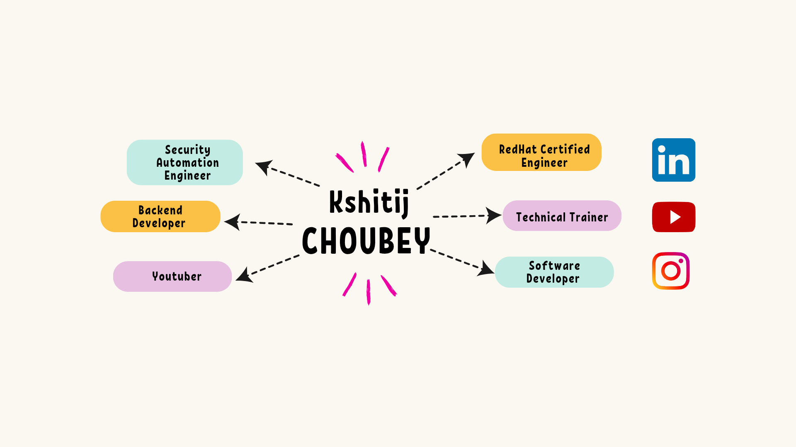

### Hi there I am Kshitij Choubey 👋

## 🚀 About Me
I am Kshitij Choubey an enthusiast, Engage with me in building a dynamic IT future! Oracle and Red Hat Certified Engineer, proficient in system administration, database management, and scripting. Eager to contribute to innovative projects in a challenging IT landscape. 

## Certifications

## 🔗 Connect with me

